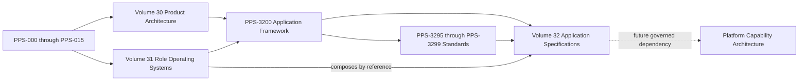

# Purpose

Volume 32 establishes the constitutional architecture for shared Platform Applications. It defines application ownership, composition, inheritance, numbering, and maturity boundaries before application-specific implementation is authorized.

# Philosophy

A Platform Application is a governed platform product that delivers a coherent user outcome across one or more Role Operating Systems. Applications are shared constitutional assets: they preserve a common service and data boundary while adapting presentation and permissions through governed composition.

# Shared Application Philosophy

Applications are reusable, composable, and independent of any single Operating System. Operating Systems consume Applications; Applications consume Platform Capabilities; Platform Capabilities consume Platform Services. No application may duplicate another canonical application's responsibility without an approved constitutional amendment.

# Operating Systems and Applications

Volume 31 defines who a Role Operating System serves, the responsibilities it enables, and the authority under which it operates. Volume 32 defines the shared applications those Operating Systems may compose. An Operating System does not own, fork, or silently redefine an application; an application does not grant role authority.

# Relationship to Volume 30 Platform Architecture

Volume 30 registers the product artifacts applications compose, including features, experiences, screens, workflows, navigation, components, APIs, data objects, events, analytics-related signals, intelligence capabilities, integrations, and releases. Volume 32 shall reference those identities rather than create parallel registries.

# Relationship to Volume 31 Role Operating System Architecture

Volume 31 defines role responsibilities, relationships, permissions, and outcomes. Volume 32 supplies shared applications to those Operating Systems through governed composition. Neither volume transfers its constitutional ownership to the other.

# Relationship to Future Platform Capability Architecture

Future Platform Capability Architecture may define reusable technical capabilities consumed by these applications. That future authority may refine capability contracts but shall not transfer application ownership, bypass PPS-3200, or authorize an unregistered implementation.

# Directory Map

| Domain | Identifier range | Documents |
| --- | --- | ---: |
| IDENTITY | PPS-3201-PPS-3204 | 4 |
| COMMUNICATION | PPS-3210-PPS-3213 | 4 |
| LEARNING | PPS-3220-PPS-3224 | 5 |
| OPPORTUNITY | PPS-3230-PPS-3234 | 5 |
| CAREER | PPS-3240-PPS-3243 | 4 |
| ATHLETICS | PPS-3250-PPS-3253 | 4 |
| COMMUNITY | PPS-3260-PPS-3263 | 4 |
| FINANCIAL | PPS-3270-PPS-3274 | 5 |
| OPERATIONS | PPS-3280-PPS-3284 | 5 |
| INTELLIGENCE | PPS-3290-PPS-3294 | 5 |
| STANDARDS | PPS-3295-PPS-3299 | 5 |

# Numbering Scheme

PPS-3200 is the parent constitutional framework. Application families occupy domain ranges from PPS-3201 through PPS-3294. Cross-application standards occupy PPS-3295 through PPS-3299. Unassigned numbers are reserved capacity and do not imply missing documents. Identifiers shall remain unique and comply with PPS-009.

# Inheritance Model

Every application document:

1. Inherits PPS-3200.
2. References Volume 30 for registered product artifacts.
3. References Volume 31 for authorized Operating System composition.
4. Preserves canonical platform data and capability ownership.
5. Conforms to PPS-3295 through PPS-3299.
6. Defines implementation-grade architecture while requiring downstream product artifacts, capability contracts, authorization, validation, and release evidence before implementation.

Where a child conflicts with PPS-3200, PPS-3200 governs unless an approved constitutional amendment explicitly supersedes it.

# Dependency Graph

Dependencies flow from constitutional foundations and product registries into the shared application framework. Role Operating Systems compose application specifications by reference; they do not become application owners. The future capability layer remains non-authoritative until its constitutional identifiers and contracts exist.

# Maturity Model

PPS-3200, PPS-3201 through PPS-3294, and PPS-3295 through PPS-3299 are canonical constitutional authorities at version 1.0.0. Their ownership, boundaries, relationships, data rules, permissions, lifecycle, experience, intelligence, observability, failure behavior, recovery, PBOS contracts, and validation rules are normative.

Canonical status establishes architectural authority; it does not claim that downstream features, screens, capabilities, services, APIs, data objects, events, integrations, tests, or releases already exist. PBOS shall fail closed until every implementation-specific artifact required by an application resolves through its governing registry and lifecycle.

# Validation

PBOS shall verify file presence, identifier uniqueness, YAML metadata, parent inheritance, dependency resolution, required headings, numbering ranges, and registry inclusion. Validation shall fail closed for unresolved identifiers, conflicting ownership, undocumented implementation detail, or an application that bypasses Volume 30 or Volume 31.

# Application Inventory

## Identity

- [PPS-3201 Profile Application](./IDENTITY/PPS-3201_PROFILE_APPLICATION.md)
- [PPS-3202 Settings Application](./IDENTITY/PPS-3202_SETTINGS_APPLICATION.md)
- [PPS-3203 Authentication Application](./IDENTITY/PPS-3203_AUTHENTICATION_APPLICATION.md)
- [PPS-3204 Identity Verification Application](./IDENTITY/PPS-3204_IDENTITY_VERIFICATION_APPLICATION.md)

## Communication

- [PPS-3210 Messaging Application](./COMMUNICATION/PPS-3210_MESSAGING_APPLICATION.md)
- [PPS-3211 Notifications Application](./COMMUNICATION/PPS-3211_NOTIFICATIONS_APPLICATION.md)
- [PPS-3212 Email Application](./COMMUNICATION/PPS-3212_EMAIL_APPLICATION.md)
- [PPS-3213 Video Meetings Application](./COMMUNICATION/PPS-3213_VIDEO_MEETINGS_APPLICATION.md)

## Learning

- [PPS-3220 Courses Application](./LEARNING/PPS-3220_COURSES_APPLICATION.md)
- [PPS-3221 Lessons Application](./LEARNING/PPS-3221_LESSONS_APPLICATION.md)
- [PPS-3222 Assignments Application](./LEARNING/PPS-3222_ASSIGNMENTS_APPLICATION.md)
- [PPS-3223 Certificates Application](./LEARNING/PPS-3223_CERTIFICATES_APPLICATION.md)
- [PPS-3224 Transcript Application](./LEARNING/PPS-3224_TRANSCRIPT_APPLICATION.md)

## Opportunity

- [PPS-3230 Opportunity Center](./OPPORTUNITY/PPS-3230_OPPORTUNITY_CENTER.md)
- [PPS-3231 Scholarships Application](./OPPORTUNITY/PPS-3231_SCHOLARSHIPS_APPLICATION.md)
- [PPS-3232 Internships Application](./OPPORTUNITY/PPS-3232_INTERNSHIPS_APPLICATION.md)
- [PPS-3233 Jobs Application](./OPPORTUNITY/PPS-3233_JOBS_APPLICATION.md)
- [PPS-3234 Competitions Application](./OPPORTUNITY/PPS-3234_COMPETITIONS_APPLICATION.md)

## Career

- [PPS-3240 Resume Application](./CAREER/PPS-3240_RESUME_APPLICATION.md)
- [PPS-3241 Portfolio Application](./CAREER/PPS-3241_PORTFOLIO_APPLICATION.md)
- [PPS-3242 Recommendation Letters Application](./CAREER/PPS-3242_RECOMMENDATION_LETTERS_APPLICATION.md)
- [PPS-3243 Career Planner Application](./CAREER/PPS-3243_CAREER_PLANNER_APPLICATION.md)

## Athletics

- [PPS-3250 Recruiting Application](./ATHLETICS/PPS-3250_RECRUITING_APPLICATION.md)
- [PPS-3251 Athlete Profile Application](./ATHLETICS/PPS-3251_ATHLETE_PROFILE_APPLICATION.md)
- [PPS-3252 Highlights Application](./ATHLETICS/PPS-3252_HIGHLIGHTS_APPLICATION.md)
- [PPS-3253 NIL Application](./ATHLETICS/PPS-3253_NIL_APPLICATION.md)

## Community

- [PPS-3260 Community Application](./COMMUNITY/PPS-3260_COMMUNITY_APPLICATION.md)
- [PPS-3261 Events Application](./COMMUNITY/PPS-3261_EVENTS_APPLICATION.md)
- [PPS-3262 Groups Application](./COMMUNITY/PPS-3262_GROUPS_APPLICATION.md)
- [PPS-3263 Mentorship Application](./COMMUNITY/PPS-3263_MENTORSHIP_APPLICATION.md)

## Financial

- [PPS-3270 Financial Planning Application](./FINANCIAL/PPS-3270_FINANCIAL_PLANNING_APPLICATION.md)
- [PPS-3271 Budgeting Application](./FINANCIAL/PPS-3271_BUDGETING_APPLICATION.md)
- [PPS-3272 Investments Application](./FINANCIAL/PPS-3272_INVESTMENTS_APPLICATION.md)
- [PPS-3273 Insurance Application](./FINANCIAL/PPS-3273_INSURANCE_APPLICATION.md)
- [PPS-3274 Tax Application](./FINANCIAL/PPS-3274_TAX_APPLICATION.md)

## Operations

- [PPS-3280 Calendar Application](./OPERATIONS/PPS-3280_CALENDAR_APPLICATION.md)
- [PPS-3281 Tasks Application](./OPERATIONS/PPS-3281_TASKS_APPLICATION.md)
- [PPS-3282 Documents Application](./OPERATIONS/PPS-3282_DOCUMENTS_APPLICATION.md)
- [PPS-3283 Files Application](./OPERATIONS/PPS-3283_FILES_APPLICATION.md)
- [PPS-3284 Search Application](./OPERATIONS/PPS-3284_SEARCH_APPLICATION.md)

## Intelligence

- [PPS-3290 AI Assistant Application](./INTELLIGENCE/PPS-3290_AI_ASSISTANT_APPLICATION.md)
- [PPS-3291 Compass Application](./INTELLIGENCE/PPS-3291_COMPASS_APPLICATION.md)
- [PPS-3292 Recommendation Engine Application](./INTELLIGENCE/PPS-3292_RECOMMENDATION_ENGINE_APPLICATION.md)
- [PPS-3293 Analytics Application](./INTELLIGENCE/PPS-3293_ANALYTICS_APPLICATION.md)
- [PPS-3294 Reporting Application](./INTELLIGENCE/PPS-3294_REPORTING_APPLICATION.md)

## Standards

- [PPS-3295 Application Lifecycle Standards](./STANDARDS/PPS-3295_APPLICATION_LIFECYCLE_STANDARDS.md)
- [PPS-3296 Cross-Application Communication](./STANDARDS/PPS-3296_CROSS_APPLICATION_COMMUNICATION.md)
- [PPS-3297 Shared Navigation Standards](./STANDARDS/PPS-3297_SHARED_NAVIGATION_STANDARDS.md)
- [PPS-3298 Application Analytics Standards](./STANDARDS/PPS-3298_APPLICATION_ANALYTICS_STANDARDS.md)
- [PPS-3299 Application Composition and Extensibility](./STANDARDS/PPS-3299_APPLICATION_COMPOSITION_AND_EXTENSIBILITY.md)

# Cross References

- PPS-008 Document Standards
- PPS-009 Identifier Registry
- PPS-010 Dependency Standards
- PPS-011 Data Governance
- PPS-012 Security and Permissions
- PPS-013 Design Language
- PPS-014 Analytics and Observability
- PPS-3000 Product Architecture Overview
- PPS-3100 Role Operating System Constitutional Framework
- PPS-3200 Platform Application Constitutional Framework
- PPS-3295 through PPS-3299 Cross-Application Standards
