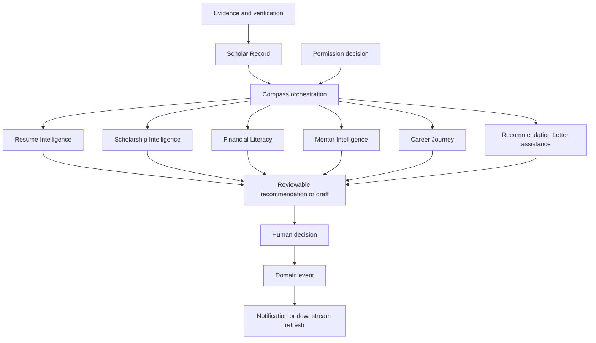

# PLAYBOOK-REVIEW-002 — Repository-Grounded Intelligence Architecture Certification

## Purpose

This report records the engineering audit of the proposed Playbook Intelligence Architecture against the repository at commit `c42cd0d`. It determines whether the documentation can become a long-term engineering authority without contradicting the Playbook Constitution, `CODEX.md`, or implemented systems.

## Ownership

Owned by Playbook OS Engineering. Product, Data, Security, and AI Governance must approve the corrective gate identified by this review.

## Last Updated

July 25, 2026

## Related Documents

- [Playbook Constitution](../../PLAYBOOK_CONSTITUTION.md)
- [Engineering Constitution](../../../CODEX.md)
- [Architecture Handbook](../../ARCHITECTURE.md)
- [Database Handbook](../../DATABASE.md)
- [Architecture Decisions](../../DECISIONS.md)
- [Delivery Tracker](../../MASTER_CHECKLIST.md)
- [Product Roadmap](../../ROADMAP.md)

## Executive Summary

**Decision: certification denied.** The requested ten-document authority set, beginning with `docs/INTELLIGENCE/README.md`, does not exist in the reviewed repository. Consequently, the review cannot prove that every reference is valid, every definition is consistent, every dependency is intentional, or all required documentation is complete. These are mandatory certification conditions, so absence is a release-blocking documentation defect rather than a reason to lower the standard.

The repository nevertheless supplies meaningful foundations: the Constitution establishes that AI assists while humans decide and that the Scholar Record is the source of truth; the architecture handbook places the Scholar Record at the platform center; migrations create `playbook_records` and supporting evidence, verification, outcome, event, notification, relationship, and recommender-request tables; and code contains Compass, recommendation, opportunity, resume, support-network, and recommender workflows. These foundations do **not** amount to the missing reconstructed architecture.

Two additional authority conflicts must be resolved in the corrective sprint:

1. The Constitution names the **Scholar Record** as the source of truth, while the database handbook calls **Playbook Record** the canonical internal person model and Scholar Record a role-aware presentation. The intelligence documents must not choose between these definitions without an accepted decision that reconciles the authorities.
2. `docs/DECISIONS.md` classifies the decision establishing Compass as **Historic**, while the requested certification standard requires Compass to remain the orchestration layer. Historic rationale is repository evidence, but it is not a current accepted mandate.

No application code was changed during this audit.

## Audit Scope and Method

The audit followed the required precedence order and treated a path, table, route, component, or behavior as implemented only when present in the checked-out tree. Repository discovery included tracked-file inventory, route-handler inventory, migration DDL inspection, focused symbol searches, and direct review of governing documents and representative engines. Marketing language, roadmap intent, UI labels, and historic ADRs were not treated as implementation proof.

The following required inputs were sought verbatim and were absent:

| Required document | Result |
| --- | --- |
| `docs/INTELLIGENCE/README.md` | Missing |
| `docs/INTELLIGENCE/ARCHITECTURE.md` | Missing |
| `docs/INTELLIGENCE/CANONICAL_STUDENT_RECORD.md` | Missing |
| `docs/INTELLIGENCE/COMPASS.md` | Missing |
| `docs/INTELLIGENCE/RESUME_INTELLIGENCE.md` | Missing |
| `docs/INTELLIGENCE/SCHOLARSHIP_INTELLIGENCE.md` | Missing |
| `docs/INTELLIGENCE/FINANCIAL_LITERACY.md` | Missing |
| `docs/INTELLIGENCE/MENTOR_INTELLIGENCE.md` | Missing |
| `docs/INTELLIGENCE/CAREER_JOURNEY.md` | Missing |
| `docs/INTELLIGENCE/RECOMMENDATION_LETTERS.md` | Missing |

Because none of the certification subjects exists, there were no in-scope Mermaid diagrams, cross-links, repository citations, or architecture claims to validate. It would be inaccurate to report them as passing by vacuity.

## Repository Verification Report

### Repository identity

| Check | Observed result |
| --- | --- |
| Git work tree | `/workspace/playbook-platform` |
| Repository basename | `playbook-platform` |
| Branch | `work` |
| Reviewed commit | `c42cd0d` |
| Remotes | No remotes configured in this checkout |
| Initial working tree | Clean |

The basename is accepted by `CODEX.md`. The branch differs from the preferred `playbook-os-v1`, but this is not itself an architecture defect. The missing remote prevents verification against the canonical GitHub origin and is recorded as an environmental provenance risk.

### Verified database surfaces

Migration DDL provides repository evidence for these relevant tables:

- Canonical-record foundation: `playbook_records`, `achievements`, `evidence`, `verifications`, `reflections`, `outcomes`, `evidence_packs`, `timeline_events`, `opportunity_matches`, and `scholar_vault_items`.
- Support and permission relationships: `support_relationships`, `support_invitations`, `support_directory_profiles`, `support_messages`, and `shared_actions`.
- Applications and letters: `recommender_requests`, `application_workspaces`, and `portfolio_shares`.
- Events and communication: `playbook_events` and `notifications`.
- Mentorship and community: `community_events` and `community_event_rsvps` supplement the support directory.
- Financial functionality is athlete-specific: `athlete_financial_entries` and `nil_deals`; there is no general financial-literacy record or planning schema.

No migration defines tables named `scholar_records`, `compass_recommendations`, `resume_intelligence`, `scholarship_intelligence`, `mentor_intelligence`, `career_journeys`, `recommendation_letters`, or `financial_literacy`. Documentation may describe those names as domain concepts or future additions, but must not claim those persistence models exist.

### Verified API surfaces

Relevant route handlers exist for event emission, notifications, mentor-directory lookup, support-network summaries/messages/actions, recommender requests, application workspaces, portfolio shares, transcript parsing, community events, invitations, and guardian/admin notifications.

There are no dedicated API route handlers for Compass, Resume Intelligence, Scholarship Intelligence, general Financial Literacy, Mentor Intelligence, Career Journey, or generated Recommendation Letters. In-process modules and pages must not be documented as public or server APIs.

### Verified routes and components

Repository routes include `/compass`, `/journey`, `/opportunities`, `/mentor-connect`, `/mentor-os`, `/support-network`, `/recommenders`, `/notifications`, and `/permissions`. Relevant components include `CompassCoreCard`, `ScholarRecordDashboard`, `ScholarRecordSummary`, `RecommendationCenter`, `OpportunityFeed`, `RecommenderWorkflowDashboard`, and support-network dashboards.

These files prove that surfaces exist, not that their workflows are production-complete. The delivery tracker explicitly keeps Compass recommendations, scholarships, mentor QA, notifications, role permissions, marketplace workflows, and end-to-end validation below Complete.

### Unsupported or unprovable architecture statements

The missing documents leave the following required claims unsupported:

1. That a reconstructed Intelligence Architecture has been recorded at the specified paths.
2. That Compass is the single current orchestration layer for all Intelligence Engines.
3. That every engine consumes one canonical Scholar Record contract.
4. That all recommendations persist input provenance, permission authorization, assumptions, evidence, verification instructions, rejection, and override state.
5. That Resume, Scholarship, Financial Literacy, Mentor, Career Journey, and Recommendation Letter functionality are formal Intelligence Engines rather than partial utilities or product surfaces.
6. That an intentional, acyclic dependency graph covers every named engine.
7. That future-engine extension contracts exist and are governed.
8. That every architecture diagram maps only to existing systems.
9. That the README indexes all Intelligence documents.

## Cross-Document Consistency Report

### Result

**Blocked by absent subject documents; not certified.** No duplicate sections or conflicting definitions can be ruled out when the full requested document set is missing.

### Repository terminology baseline

The corrective sprint should use this baseline unless an accepted ADR changes it:

| Term | Repository-grounded meaning | Finding |
| --- | --- | --- |
| Scholar Record | Primary product source of truth for Scholar facts, achievement, evidence, relationships, readiness, and opportunity activation. | Constitutionally required. |
| Canonical Student Record | Use only as an alias for Scholar Record, not a second model. | No repository type or table uses this name. |
| Playbook Record | Database handbook's proposed canonical internal person model. | Conflicts with the requested “Scholar Record only” standard and needs reconciliation. |
| Compass | Guidance/reasoning/recommendation code and UI that produces scores, recommendations, and next actions. | Present, but current universal orchestration authority is unproven. |
| Support Network | Relationship-scoped people, invitations, messages, and shared actions supporting a Scholar. | Implemented in multiple bounded modules and tables. |
| Recommendation | An advisory output or human recommendation context/request; not an automatic decision. | Multiple meanings require qualified phrases such as “Compass recommendation” and “recommendation letter.” |
| Journey | A guided sequence or stateful workflow toward a Scholar goal. | Several journey modules exist; no single canonical journey model was found. |
| Opportunity | A college, scholarship, job, internship, mentorship, or related match/action surfaced from Scholar signals. | Models and matching code exist; production completeness is not established. |
| Verification | A durable decision or state connecting claims/evidence to trusted review. | Model and migration evidence exists. |
| Permission | Relationship- and role-scoped authorization, enforced in application logic and RLS at the data boundary. | Required by handbooks; complete cross-layer enforcement is not proven. |
| Evidence | Durable proof with provenance, ownership, visibility, lifecycle, and verification state. | Model and migration evidence exists. |
| Explainability | A user-readable account of recommendation basis and recourse, including inputs, permission, assumptions, evidence, verification, and override. | Existing Compass explanation is materially narrower. |
| Human Agency | AI assists or drafts; humans decide and approve. | Direct constitutional requirement. |
| Events | Durable domain facts with actor, subject, payload, permissions, lifecycle, and consumers. | Event bus and persistence exist; adoption is partial. |
| Notifications | Recipient-facing delivery derived from events and preferences. | API, table, and engines exist; end-to-end readiness remains partial. |
| Resume Intelligence | Scholar-Record-consuming assistance that drafts resume content for Scholar review. | Only a small resume draft utility is evidenced. |
| Scholarship Intelligence | Advisory matching/readiness for scholarships, never eligibility or award guarantees. | No dedicated engine is evidenced. |
| Mentor Intelligence | Permission-aware suggestions that help mentors support Scholar-owned goals. | Mentor/support features exist; no dedicated engine is evidenced. |
| Career Journey | Scholar-controlled guided actions toward career goals and outcomes. | Career fields and generic journeys exist; no dedicated engine is evidenced. |
| Recommendation Letters | Human-authored letters aided by requests, evidence, context, and optional drafting. | Request and draft utilities exist; independence controls are incomplete. |
| Financial Literacy | Educational and planning support, not individualized financial advice or automatic action. | Athlete/NIL utilities exist; no general engine is evidenced. |

## Dependency Audit

### Required target dependency direction

This diagram is a **corrective target**, not a description of the current repository.

### Current findings

- `lib/compass/CompassEngine.ts` directly composes Academic Intelligence, Opportunity Graph matching, reasoning, goals, recommendations, next actions, and a score explanation. This supports Compass as one orchestrator for that flow.
- Separate recommendation implementations exist under Academic Intelligence, Compass, and Intelligence Platform. Their responsibilities and precedence are not governed by the missing architecture.
- Two different `buildScholarRecord` functions exist under `lib/scholar/record.ts` and `lib/portfolio/scholar-record.ts`; they assemble different shapes. This is a competing-contract risk even if both are adapters rather than persistence models.
- Compass consumes `{ courses, trustScore }`, not an explicit canonical Scholar Record. The current signature therefore does not prove the required consume-not-replace invariant.
- Resume and recommendation helpers consume a loose portfolio value, not a strict Scholar Record contract.
- Event handlers cover several existing engines, but the named proposed engines do not each have documented event inputs and outputs.
- No complete engine registry or dependency manifest exists. Circular dependencies were not observed in representative code, but cannot be certified for an absent declared graph.
- Scholarship Intelligence, general Financial Literacy, Mentor Intelligence, and Career Journey are orphan concepts in the proposed set because dedicated engine boundaries are not present.

**Dependency conclusion:** no known cycle was proven, but intentionality, completeness, non-duplication, and orchestration ownership fail certification.

## Canonical Student Record Audit

### Findings

1. The Playbook Constitution explicitly says the Scholar Record is the source of truth and that engines interpret it.
2. `docs/ARCHITECTURE.md` calls the Scholar Record the platform's primary source of truth.
3. `docs/DATABASE.md` instead says Playbook Record is the canonical internal model and Scholar Record is a role-aware presentation.
4. The database migration persists `playbook_records`; no `scholar_records` table exists.
5. Application code exposes at least two Scholar Record builders with non-identical output contracts.
6. Compass and portfolio helpers do not consistently accept an explicit, typed Scholar Record.

### Verdict

The Scholar Record remains the highest-authority canonical concept, but the “only Canonical Student Record” invariant is not sufficiently encoded or documented to certify. The smallest remedy is to adopt one ADR that distinguishes conceptual authority, persistence name, and adapter contracts; define one canonical type; and label all legacy or presentation adapters. It is not necessary to rename the existing table if the mapping is explicit.

Every engine document must contain a status matrix with exactly these headings: **Current implementation**, **Required additions**, and **Future vision**. Current facts must cite repository paths; required work must not use present tense; future vision must not be represented as shipped.

## Explainability Audit

| Required explanation | Repository evidence | Result |
| --- | --- | --- |
| Why generated | Recommendation engines provide short `reason`, `reasons`, or `explanation` fields. | Partial |
| Scholar Record data used | Compass accepts courses/trust score, but output does not expose an input manifest or field provenance. | Fail |
| Authorizing permissions | Recommendation outputs contain no authorization decision or policy reference. | Fail |
| Assumptions | Defaults such as trust score and academic progress are applied but not returned as assumptions. | Fail |
| Supporting evidence | Some letter tooling accepts evidence, but general recommendations do not carry evidence references. | Fail |
| How to verify | No common verification instructions were found in recommendation contracts. | Fail |
| Reject or override | No common dismissal, rejection, override, or reason-capture contract was found. | Fail |

The current Compass explanation maps only a numeric range to a generic sentence. It is useful UI copy, not a complete explainability record. The database handbook describes future AI audit-log fields, but no migration implements such a table. Therefore every-recommendation explainability is **not certified**.

## Human Agency Audit

| Principle | Finding | Result |
| --- | --- | --- |
| Recommendations do not become automatic decisions | Existing recommendation functions return advisory objects; no automatic acceptance was found. | Partial pass; system-wide enforcement unproven |
| Scholar retains authority | Constitution requires human control, but no universal recommendation-state contract records Scholar acceptance/rejection. | Partial |
| Mentors support, not replace | Permission map allows mentors to recommend actions and support tasks, not own Scholar decisions. | Partial pass |
| Guardians reinforce, not override | Guardian permissions omit recommendation and verification, but end-to-end RLS parity is not certified. | Partial pass |
| Independent letter authorship | Letter utility generates complete prose and its checklist says “Approve final letter,” but it does not establish recommender-only editing, attribution, disclosure, or final submission controls. | Fail |
| Scholarships are recommendations, not guarantees | No dedicated engine or governing document exists to enforce wording and outcome boundaries. | Fail |

No evidence was found of an engine automatically making admissions, scholarship, career, mentorship, or financial decisions. Absence of detected automation is not equivalent to an enforceable architecture guarantee.

## Repository Alignment Report

| Intelligence domain | Already implemented | Partially implemented | Missing implementation | Future extension boundary |
| --- | --- | --- | --- | --- |
| Compass | Page, component, report builder, reasoning, goals, recommendations, next actions, and score explanation. | Inputs are narrow; orchestration is not universal; provenance, permissions, evidence, recourse, persistence, and API boundary are absent. | Governed recommendation envelope and accepted orchestration decision. | Add engines through a registry/contract after governance, not direct ad hoc imports. |
| Resume Intelligence | `generateResumeDraft` and resume builder/toolkit code. | Drafting from portfolio fields. | Typed Scholar Record input, provenance, permission check, evidence links, review lifecycle, tests, and persistence/API if required. | Versioned templates and opportunity-specific variants may follow the same envelope. |
| Scholarship Intelligence | Scholarship labels, opportunity matching concepts, and Scholar Record AI placeholder fields. | Scholarship surfaces are tracked as Partial. | Dedicated bounded engine, data source, eligibility semantics, explainability, disclaimers, validation, and tests. | Additional providers and deadlines without changing the canonical input contract. |
| Financial Literacy | Scholar-athlete financial and NIL modules plus athlete financial table. | Athlete-specific calculations/workflows. | General educational domain, scope/safety policy, permissions, evidence/provenance, non-advice boundaries, and tests. | Financial Planning only after a separate high-risk governance review. |
| Mentor Intelligence | Mentor routes, directory API/table, role config, permissions, and support-network workflows. | Assistance and relationship context. | Dedicated engine contract, Scholar consent, explanation/recourse, bounded mentor visibility, and tests. | Matching and coaching suggestions through the same permission-aware interface. |
| Career Journey | Career fields, journey pages/modules, opportunity graph signals, and outcomes table. | Generic journeys and career data. | Canonical journey state model, dedicated engine ownership, persistence mapping, explainability, and tests. | Internship, research, volunteer, and entrepreneurship journeys as typed variants. |
| Recommendation Letters | Request API/table, recommender pages/component, context, brag sheet, and draft generator. | Request and draft UX. | Independent authorship controls, recommender-only finalization, AI disclosure, provenance, consent, secure delivery, audit state, and tests. | Institution-specific requirements without weakening author independence. |

The status language above intentionally distinguishes file presence from production readiness and follows the delivery tracker's evidence standard.

## Engineering Readiness Report

Scores apply to the proposed Intelligence Architecture as certifiable documentation plus its repository alignment, not to the entire Playbook product.

| Category | Score | Justification | Corrective action |
| --- | ---: | --- | --- |
| Architecture quality | 4/10 | Strong constitutional principles and several domain modules exist, but the authoritative architecture and current orchestration decision are absent. | Create the missing authority set and accept one orchestration ADR. |
| Maintainability | 4/10 | Duplicate Scholar Record builders and recommendation engines create drift risk. | Declare canonical contracts, adapters, owners, and deprecation paths. |
| Extensibility | 5/10 | Domain modules and events offer useful seams, but there is no governed engine interface or registration model. | Define versioned engine input/output and event contracts. |
| Repository alignment | 3/10 | Useful implementation exists, but none of the requested architecture documents can be compared to it. | Add per-claim repository evidence and status matrices. |
| Implementation readiness | 3/10 | Several UI and utility foundations exist; core permission, provenance, persistence, and recourse contracts do not. | Complete the corrective documentation gate before implementation planning. |
| Testing readiness | 4/10 | Unit tests exist for adjacent intelligence systems, but no conformance suite covers the named architecture. | Specify fixtures and contract tests for provenance, permissions, determinism, recourse, and agency. |
| Documentation quality | 2/10 | Governing handbooks are structured, but the entire requested Intelligence set is absent. | Author and cross-link all ten documents without claiming unbuilt behavior. |
| Governance quality | 4/10 | Constitution and ADR practices are strong; Compass status and record naming are unresolved. | Record accepted decisions and owners; define review/change control. |
| Risk management | 3/10 | General trust and AI principles exist, but engine-specific safety controls are not documented or enforced. | Add risk classification, audit data, human review, rollback, and incident ownership. |
| Technical debt | 3/10 | Loose `LegacyValue` boundaries, parallel builders, parallel recommendation engines, and missing audit persistence are material debt. | Inventory and sequence debt; do not mask it with future-state language. |

No category earns 10 because none has complete evidence against the required certification standard.

## Cross-Link Validation Report

- All links authored in this report are relative links to files verified in the repository.
- Every required `docs/INTELLIGENCE/*` target is missing, so no link graph for that document set exists.
- The required README cannot index the engine documents because the README itself is absent.
- There are no in-scope source Mermaid diagrams to render or validate.
- The Mermaid diagram in this report uses supported `flowchart TD` syntax and references conceptual corrective targets only.
- No orphan-document pass can be granted until the Intelligence directory exists and is linked from the canonical handbook or an explicitly governed supplemental index.
- The report found no duplicate sections in a nonexistent subject set; this is **not** a pass.

## Future Expansion Audit

The current repository has promising extension seams—domain modules, repositories, an event bus, permission utilities, and Compass composition—but it cannot yet support new Intelligence Engines **without architecture-level ambiguity**. Admissions, Internship, Research, Volunteer, Entrepreneurship, AI Tutor, Financial Planning, and Employer Matching must not be implemented under this certification ticket.

Future expansion becomes viable without redesign when all engines can:

1. consume a versioned canonical Scholar Record view rather than create a competing student model;
2. receive a policy decision and least-privilege input projection;
3. emit one standard recommendation/draft envelope containing provenance, assumptions, evidence, confidence/limits, verification guidance, and recourse;
4. route cross-engine coordination through Compass while retaining independent domain ownership;
5. emit versioned events without importing downstream engines;
6. persist auditable state only through documented repositories and RLS-protected tables;
7. declare lifecycle, owner, risk class, tests, and deprecation behavior; and
8. distinguish implemented, required, and future behavior in documentation.

These are contract clarifications around the repository's existing direction, not a proposal to implement the example engines.

## Risk Register

| ID | Risk | Severity | Evidence | Minimum mitigation | Owner |
| --- | --- | --- | --- | --- | --- |
| R-001 | Required Intelligence authority set is absent. | Critical | All ten required paths missing. | Complete the corrective documentation sprint and rerun certification. | Engineering Docs |
| R-002 | Scholar Record and Playbook Record compete for canonical wording. | Critical | Constitution/architecture and database handbook differ. | Accepted ADR defining conceptual and persistence mappings. | Architecture + Data |
| R-003 | Compass orchestration mandate lacks a current accepted decision. | High | Compass ADR is Historic while certification requires current authority. | Reaffirm, replace, or explicitly reject via accepted ADR. | Architecture Council |
| R-004 | Parallel record builders can yield divergent engine inputs. | High | Two `buildScholarRecord` implementations with different shapes. | Name one canonical contract and mark adapters explicitly. | Scholar Record owner |
| R-005 | Parallel recommendation engines duplicate responsibility. | High | Academic, Compass, and Intelligence Platform implementations. | Define boundaries and a shared output envelope. | Intelligence owner |
| R-006 | Recommendations lack complete provenance and recourse. | Critical | No common permission, input, assumption, evidence, verify, reject, or override fields. | Specify and test an auditable recommendation envelope. | AI Governance + Security |
| R-007 | Letter drafting can blur independent authorship. | Critical | Utility generates complete letter text without final-author controls. | Require recommender-only review/finalization, attribution, and audit trail. | Product + Legal |
| R-008 | General financial guidance could exceed documented safety scope. | High | Only athlete/NIL financial code exists; general architecture absent. | Define education/non-advice boundaries before expansion. | Legal + Product |
| R-009 | UI presence may be mistaken for production completeness. | High | Delivery tracker marks related workflows Partial/Testing. | Require per-engine status matrices and evidence links. | Engineering |
| R-010 | Permission documentation may overstate enforcement. | Critical | Permission helpers exist; system-wide RLS parity is not proven. | Map every read/write to app authorization and RLS tests. | Security + Data |
| R-011 | No remote is configured, limiting provenance verification. | Medium | `git remote -v` returned no entries. | Verify canonical origin in the integration environment before merge/release. | Release Engineering |
| R-012 | Future engines may become orphaned or bypass Compass. | High | No registry, manifest, or conformance contract. | Add a governed engine catalog and dependency table. | Architecture Council |

## Open Questions

These questions require owner decisions; this review does not invent answers:

1. Is `playbook_records` the persistence representation of the canonical Scholar Record, or is “Playbook Record” intended as a broader canonical model? Which accepted ADR governs the mapping?
2. Should Compass be reaffirmed as the only cross-engine orchestrator, given that its existing ADR is Historic?
3. Which existing recommendation implementation owns the shared recommendation contract, and which are domain adapters?
4. What exact Scholar-consent scopes allow mentors, guardians, educators, institutions, and employers to receive derived intelligence?
5. Which recommendations require explicit human review before notification, sharing, export, or persistence?
6. What retention, deletion, correction, and model-version requirements apply to recommendation provenance?
7. Who may view assumptions and evidence references when source data has stricter visibility than the recommendation?
8. Must recommendation rejection/override reasons be optional, and who may use them for future ranking?
9. What constitutes independent authorship for AI-assisted recommendation letters, and what disclosure is required?
10. Is Financial Literacy limited to education, or will future Financial Planning require regulated-advice review?
11. Which events are durable public domain contracts versus internal implementation details?
12. Which team owns each Intelligence document and approves changes to engine boundaries?

## Recommended Improvements

### Smallest corrective sprint: PLAYBOOK-REVIEW-002A

Do not redesign or implement engines. Reconstruct and reconcile the authority set using existing evidence.

1. Create `docs/INTELLIGENCE/README.md` and the nine named subject documents, each with purpose, ownership, last-updated date, related links, and an explicit authority/status notice.
2. Add an accepted ADR reconciling Scholar Record, Playbook Record, the `playbook_records` table, and the two application builders. Preserve existing names where possible.
3. Add an accepted ADR establishing whether Compass is the current sole cross-engine orchestrator and defining domain-engine independence.
4. Give each engine document a repository evidence table and separate **Current implementation**, **Required additions**, and **Future vision** sections.
5. Define, but do not yet implement, a typed recommendation envelope covering data-field provenance, authorization, assumptions, evidence, verification, confidence/limits, human review, rejection, override, and outcomes.
6. Document an acyclic dependency table with owner, inputs, outputs, events, persistence, and forbidden dependencies for every engine.
7. Add explicit authorship and submission boundaries to Recommendation Letters and non-guarantee/non-advice boundaries to Scholarship and Financial Literacy.
8. Validate every path, anchor, Mermaid block, and implementation claim; then rerun PLAYBOOK-REVIEW-002 as an independent certification gate.

### Validation required for the corrective sprint

- A script must fail on broken local Markdown links and missing README index entries.
- Mermaid blocks must parse in the repository's chosen renderer.
- Every backticked repository path and named table/API/component must resolve through a generated evidence manifest or manual evidence table.
- A terminology scan must flag unqualified competing uses of Student Record, Scholar Record, Playbook Record, recommendation, and journey.
- Architecture review must prove one canonical record contract, one cross-engine orchestrator, no cycles, no orphan engine, and no duplicated responsibility.
- Security review must map recommendation inputs/outputs to permission decisions and RLS boundaries.
- Product/Legal review must approve agency, scholarship, financial, and letter-authorship language.

## Certification Decision

**NOT CERTIFIED — corrective sprint required.**

Certification is withheld because:

- every required Intelligence document is missing;
- repository references and diagrams in those documents therefore cannot be verified;
- the canonical record terminology is unresolved across higher authorities;
- Compass's current orchestration authority is not established by an accepted decision;
- named engines do not have complete, intentional dependency contracts;
- future state cannot be checked for separation from current implementation;
- every-recommendation explainability and human-recourse requirements are not implemented or documented; and
- required documentation completeness and cross-link conditions fail.

The next engineering gate is **not prepared here**. The mission requested preparation of a next gate only if certification is granted. Preparing it despite denial would bypass the stated gate. PLAYBOOK-REVIEW-002A above is the minimum corrective sprint, after which the complete certification audit must be repeated. No implementation should begin from the missing Intelligence authority set until the user approves that corrective sprint.
