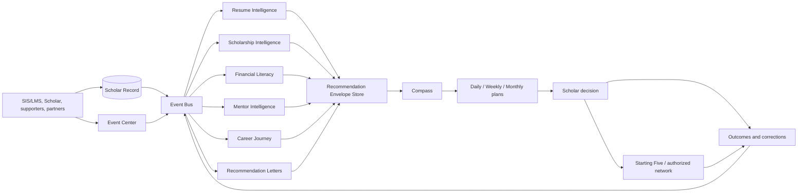

# Playbook Intelligence Architecture

## Purpose
Define the constitutional architecture that converts permission-authorized Scholar Record evidence into explainable, human-controlled guidance across Playbook journeys.

## Ownership
Owned by Playbook OS Engineering. Material policy/model changes require product, privacy, accessibility, safety, and affected-domain review.

## Last Updated
July 24, 2026

## Related Documents
- [Engineering Constitution](../../CODEX.md)
- [Constitutional review](./CONSTITUTIONAL_REVIEW.md)
- [Canonical Student Record](./CANONICAL_STUDENT_RECORD.md)
- [Architecture handbook](../ARCHITECTURE.md)
- [Database handbook](../DATABASE.md)
- [Decision records](../DECISIONS.md)

## Mission, vision, and problem statement
**Mission:** transform trusted Scholar Record context into the highest-value actions a Scholar can understand, choose, and complete with support. **Vision:** every Scholar receives consistent, timely guidance without losing agency or human relationships. **Problem:** guidance is fragmented across institutions and life stages; deadlines, eligibility and evidence are hard to synthesize; existing tools often provide opaque generic rankings rather than a coordinated plan.

## Constitutional status and terminology
This is the normative detail of the existing Constitution's Intelligence Architecture amendment. It does not supersede the product constitution or architecture/data handbooks. “Canonical Student Record” maps to the existing **Scholar Record**. Portfolio, resume, packet, profile and dashboard are authorized projections, never competing sources of truth.

## Guiding principles
1. Scholar agency: recommend; do not decide or submit without explicit authorization.
2. AI assists; humans decide: consequential outputs have review, override and escalation.
3. Evidence before inference: cite provenance, verification, freshness and uncertainty.
4. Opportunity over engagement: optimize for beneficial completion and confidence, not clicks.
5. Support amplification: route appropriate actions to authorized supporters; never silently replace them.
6. Least privilege and purpose limitation: each computation declares why it needs each field.
7. Explainability by construction: store reason codes and evidence references with scores.
8. No single score defines a Scholar: scores are contextual, appealable and time-bound.
9. Accessible, equitable alternatives: users can inspect, correct, defer and use non-AI workflows.
10. Engine independence: engines publish stable contracts/events; Compass orchestrates without owning domain truth.

## Functional requirements
- Ingest record changes and authoritative opportunity/deadline events idempotently.
- Evaluate eligibility separately from priority; never hide an uncertain candidate as ineligible.
- Produce recommendation envelopes; deduplicate and resolve conflicts across engines.
- Support daily focus, weekly plan and monthly horizon, plus urgent deadline/risk escalation.
- Capture lifecycle outcomes and corrections while retaining policy/model version.
- Link every action to Event Center, the relevant record/evidence, and authorized support workflows.
- Provide manual creation, editing, dismissal, snoozing, appeal and completion paths.

## Shared recommendation model
```ts
RecommendationEnvelope = {
  id, scholarId, engine, type, title, action, goalIds[],
  evidenceRefs[], opportunityId?, eventId?, supportRole?,
  eligibility: { state: eligible|ineligible|uncertain, reasons[] },
  score: { priority, impact, urgency, confidence, effort, equityAdjustment? },
  explanation: { summary, reasonCodes[], missingData[], alternatives[] },
  timing: { generatedAt, actionableAt, dueAt?, expiresAt?, timezone },
  governance: { policyVersion, modelVersion?, humanReview, source },
  lifecycle: proposed|shown|accepted|snoozed|dismissed|completed|expired|withdrawn|overridden
}
```
Priority is a bounded, versioned policy function of expected goal impact, deadline urgency, readiness, confidence, effort, dependency unlocks and harm/risk reduction. Equity adjustments may restore access or compensate for missing structural opportunity; they must never infer protected traits, lower standards secretly, or be used punitively. Tie-breaking favors approaching deadlines, prerequisite unlocks, stated Scholar goals and lower burden. Hard safety/eligibility rules are separate from ranking.

## Recommendation lifecycle and explainability
`proposed → shown → accepted → completed`; alternate transitions are `snoozed`, `dismissed`, `expired`, `withdrawn`, and authorized `overridden`. Every transition records actor, time and reason. A recommendation must answer: why this, why now, what evidence was used, what is uncertain/missing, what happens next, who can help, and what alternatives exist. Generated prose cannot replace structured reason codes.

## Canonical data model
Shared entities are Scholar, goal, record item, evidence, verification, permission grant, support relationship, opportunity, eligibility evaluation, recommendation, plan, deadline/event, task, outcome, policy version, model version and audit entry. Domain specifications may extend but not redefine these identities. IDs are stable; projections carry `asOf` and source versions.

## Permission, privacy, ethics, verification, accessibility
- Access requires ownership or an active relationship/institutional grant with purpose, scope and expiry; RLS remains the database backstop.
- Highly sensitive financial, disability, immigration, disciplinary, minor and private communication data is excluded by default and requires explicit approved policy.
- Collect minimum data, define retention/deletion/export, redact logs, encrypt boundaries, and prevent training reuse without separate consent.
- Recommendations disclose inference and uncertainty. Scholars can correct source facts and appeal outcomes. Bias and outcome audits are segmented only when lawful, consented and privacy-preserving.
- Evidence carries provenance, assurance (`self_attested`, `corroborated`, `verified_authority`), verifier authority, timestamps, expiry and dispute state.
- All surfaces meet WCAG expectations in the design handbook: keyboard/screen reader operation, plain language, non-color status, zoom/reflow, reduced motion, localized dates, and equivalent human/manual paths.

## Cross-engine integration diagram

Compass coordinates recommendations; it does not mutate domain records directly. Engines subscribe to versioned events and publish envelopes/outcomes. Event Center owns calendar presentation and normalized time semantics, not domain eligibility.

## Non-functional requirements
- Deterministic rule paths and reproducible policy versions; idempotent event processing and replay.
- Availability targets set per workflow; missed-deadline paths require monitoring and dead-letter recovery.
- Bounded latency: interactive explanations under product SLO; batch recomputation observable and resumable.
- Full auditability without storing unnecessary prompt content; structured metrics and trace IDs.
- Secure server execution, tenant isolation, rate limiting and adversarial input/content defenses.
- Graceful degradation to record views, saved plans and human support when AI or integrations fail.

## Integration points and dependencies
Depends on Scholar Record, evidence/verification, Trust Layer, Event Bus, Event Center, permissions/RLS, Starting Five, notifications, messaging, Portfolio and opportunity graph. External adapters require contracts for authority, refresh, reconciliation, consent, deletion and outage handling. Generative AI is optional behind stable domain interfaces.

## Governance and change control
Policy owners approve rule versions; model cards document intended use, exclusions, evaluation and rollback. Material scoring or data-use changes require an ADR, threat/privacy review, accessibility evaluation, offline benchmark, staged rollout and kill switch. No engine may self-modify production policy. Human overrides are logged but never treated automatically as ground truth.

## Implementation roadmap
1. **Foundation:** reconcile terms; inventory actual tables/events; define shared schemas, reason codes, permission matrix and data classification.
2. **Deterministic core:** implement envelopes, eligibility, deadlines, lifecycle/audit and manual explanations with contract tests.
3. **Engine adoption:** migrate each domain behind adapters; connect Event Center and support workflows; preserve old projections during reconciliation.
4. **Measured intelligence:** add calibrated ranking and scenario models, outcome evaluation, fairness/accessibility audits and human review dashboards.
5. **Future reasoning:** constrained AI planning and natural-language explanations over retrieved authorized evidence; never autonomous consequential action.

## Success metrics
Beneficial action completion; on-time deadline completion; verified-record growth; opportunity applications and outcomes; plan follow-through; explanation comprehension; correction/appeal resolution; support response; recommendation coverage across groups; calibration/error rates; stale/duplicate rate; accessibility task completion; privacy/security incidents. Engagement alone is not success.

## Future expansion
Privacy-preserving institutional analytics, portable credentials, interoperable wallets, multilingual coaching, offline/low-bandwidth plans, scenario simulation, federated opportunity networks and longitudinal alumni journeys—only after governance review.

## Open questions
Who approves domain policy versions? Which jurisdictions/ages launch first? What evidence assurance is required per action? Which sensitive fields are categorically excluded? What are retention and portability rules after graduation? What source is authoritative when integrations conflict? Which outcomes may tune rankings? What service levels apply to urgent deadlines and safety escalations?
