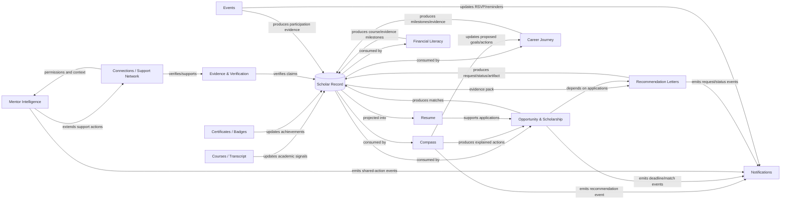

# Intelligence Architecture

## Purpose
Define how existing Playbook intelligence capabilities relate to the authoritative Scholar Record and to one another, while separating repository state from extensions.

## Ownership
Owned by Playbook OS Engineering.

## Last Updated
July 25, 2026

## Related Documents
- [Intelligence index and certification](./README.md)
- [Canonical Student Record](./CANONICAL_STUDENT_RECORD.md)
- [Platform architecture](../ARCHITECTURE.md)
- [Event catalog](../ARCHITECTURE/EVENT_CATALOG.md)

## Constitutional Boundary
The Scholar Record is the system of record. Intelligence engines are deterministic or future assisted services that **consume** authorized Record projections and **produce** explanations, recommendations, candidate artifacts, events, or proposed updates. A projection never becomes a competing canonical profile. A proposed update does not become fact until validated, permission-checked, and accepted through the relevant workflow.

Current code supports this direction: Compass composes academic and opportunity modules in [`lib/compass/CompassEngine.ts`](../../lib/compass/CompassEngine.ts); application data is projected from profile, courses, certificates, evidence, goals, and athletics in [`lib/scholar-data/scholarApplicationData.ts`](../../lib/scholar-data/scholarApplicationData.ts); events become role-aware notifications in [`lib/event-notifications/eventNotificationPipeline.ts`](../../lib/event-notifications/eventNotificationPipeline.ts).

## Current Repository State and Capabilities

The application uses Next.js App Router surfaces, domain modules under `lib/`, Supabase-backed server routes, and migration-managed tables/RLS. Intelligence exists at four layers:

1. **Record and trust:** Scholar models, Playbook graph, evidence, verification, permission and sharing rules.
2. **Interpretation:** academic readiness, Compass reasoning, opportunity matching, network intelligence.
3. **Action:** applications, recommendations, support actions, journey milestones, events.
4. **Delivery:** routes/components, notifications, digest/escalation, portfolios and exports.

Authentication and RLS form the trust boundary. Application role checks supplement—not replace—database policy. Tests under [`tests/unit/`](../../tests/unit/) cover the major recovered engines and workflows.

## Cross-Engine Dependency Diagram

## Relationship Semantics

| Relationship | Current grounding | Required invariant |
|---|---|---|
| Consumes | Compass consumes academics/trust/opportunity scores; resume mapper consumes scholar data | Minimum necessary, permission-filtered Record projection |
| Produces | Matchers produce reasons/matches; recommenders produce request state; pipelines produce notifications | Typed output with source and version |
| Depends On | Support features depend on relationships; APIs depend on auth/Supabase | Server trust and RLS cannot be bypassed |
| Updates | Courses, achievements, evidence, outcomes, timeline events update the Record | Validated command; never silent mutation |
| Verifies | Supporters/educators can verify evidence under role permissions | Actor, claim, time, status, provenance and revocation |
| Extends | New journeys extend existing record/events/components | No parallel record, role registry, event bus, or notification system |

## Current Limitations
- Several helpers and surfaces contain demo or fallback values, including the static network returned by [`lib/support-network/supportNetwork.ts`](../../lib/support-network/supportNetwork.ts).
- Compass accepts a narrow input and defaults trust to a fixed value; persistence/provenance is not part of its report contract.
- The resume projection uses permissive legacy values and does not expose verification state.
- Scholarship, financial literacy, mentor matching, and career journey do not yet have complete named engine contracts.
- Cross-layer application permissions and Supabase RLS require continuing parity audits.
- Recommendation/event artifacts need explicit retention, audit, idempotency, and revocation rules.

## Recommended Constitutional Extensions
1. Define a typed, versioned, permission-filtered Scholar Record projection in the existing record domain.
2. Attach `source`, `generated_at`, `engine_version`, evidence references, and human-readable reasons to intelligence outputs.
3. Model recommendations as proposals with accept, dismiss, defer, and edit actions; record the scholar's choice.
4. Reuse Playbook events and notifications for lifecycle changes, with deduplication and user preferences.
5. Extend existing evidence/verifications for provenance rather than inventing engine-specific truth stores.
6. Require bias, accessibility, privacy, RLS, and human-review validation appropriate to each engine.

## Future Vision
With approval, the existing deterministic engines may be augmented by assisted extraction or ranking. Such assistance must be grounded in authorized Record evidence, disclose uncertainty and rationale, permit correction, and never replace counselors, family, educators, mentors, employers, or scholar decision-making.

## System Validation and Success Metrics
- Contract tests prove all projections map to the authoritative Record.
- RLS and application permission matrices agree for each role/relationship.
- Recommendation acceptance/dismissal and reason visibility are measured separately from conversion.
- Provenance coverage, stale-output rate, duplicate-event rate, and correction rate are observable.
- Equity review compares availability and outcomes without turning protected traits into unjustified ranking signals.
- Success means increased verified Record completeness and useful human-supported action—not maximal automation.

