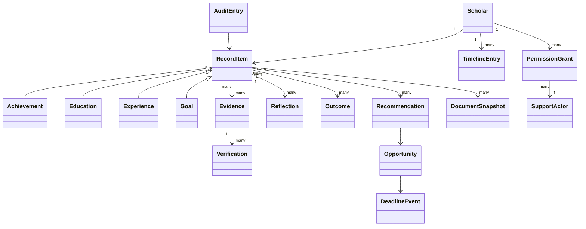

# Canonical Student Record Constitutional Specification

## Purpose
Extend—not replace—the Scholar Record model as the lifelong, permissioned source from which Playbook projections and intelligence are derived.

## Ownership
Owned by Playbook OS Engineering and Data Governance; the Scholar is the primary data subject and steward of their story.

## Last Updated
July 24, 2026

## Related Documents
- [Intelligence Architecture](./ARCHITECTURE.md)
- [Scholar Record Data Model](../ENGINEERING/SCHOLAR_RECORD_DATA_MODEL.md)
- [Database handbook](../DATABASE.md)

## Mission, vision, and problem statement
**Mission:** preserve a Scholar's identity, growth, evidence, relationships and goals once, for lifelong reuse. **Vision:** one portable, trustworthy story that the Scholar controls across institutions and life stages. **Problem:** achievements and guidance context are fragmented, repeatedly entered, weakly verified and lost at transitions.

## Guiding principles
One Scholar/one record; living evidence; append history rather than silent overwrite; explicit provenance; projections rather than duplicate stores; contextual visibility; data minimization; correction and portability; extensible typed domains; no permanent deficit labels.

## Functional requirements
- Create, import, correct, merge, archive, export and selectively share record items.
- Attach evidence, reflection, verification, outcomes and timeline entries.
- Distinguish asserted facts, imported facts, inferences and generated summaries.
- Support versioned snapshots for applications, resumes and letters without freezing the live record.
- Resolve source conflicts without destroying either source; expose authority and `asOf` time.
- Notify affected engines through idempotent events.

## Canonical data model
| Domain | Required scope |
| --- | --- |
| Identity | Legal/preferred name separation, pronouns optional, contact, location granularity, languages, role, age/consent band; sensitive identifiers segregated |
| Education | Institutions, enrollment, grade/level, transcripts, GPA provenance, courses, credits, assessments, attendance only when approved |
| Athletics | Sport, team, position, seasons, statistics, eligibility, recruiting, coach, evidence |
| Leadership / service | Organizations, roles, projects, community service and volunteer work, dates, hours, beneficiaries, verifier |
| Work / opportunity | Employment, internships, projects, responsibilities, skills, outcomes, supervisors |
| Recognition / learning | Awards, certificates, courses, competencies, issuers, issue/expiry dates |
| Financial literacy | Learning progress, simulations, certificates and goals; not bank credentials or unnecessary account-level data |
| Scholarships | Matches, eligibility snapshots, applications, packets, awards and conditions |
| Mentorship / support | Mentor and support relationships, role, consent, scope, availability, interactions and health—not private message bodies by default |
| Goals | Goals, milestones, dependencies, target dates, status, rationale, dream schools and career interests |
| Documents | Resume evidence, recommendation evidence, generated projections and immutable submission snapshots |
| Governance | Permissions, verification, timeline, evidence, audit history, source sync and retention state |

Core relations are `Scholar 1—N RecordItem`; `RecordItem N—N Evidence`; `Evidence 0—N Verification`; `RecordItem 0—N Reflection/Outcome`; `Scholar 1—N Goal`; `Goal N—N Recommendation`; `Scholar N—N SupportActor` through scoped `PermissionGrant`; and snapshots reference exact record/evidence versions.

## Relationship diagram

## Evidence, verification, timeline, and audit
Evidence includes type, URI/storage reference, owner, source, capture method, checksum where appropriate, issued/observed time, visibility, retention, assurance and dispute state. Verification records verifier identity/authority, scope, decision, method, time, expiry and revocation. Timeline is a chronological projection, not a parallel store. Audit is append-only for access and mutations, includes actor/purpose/diff/source/correlation, and is separately protected and retained.

## Permission model
Scholar ownership does not imply unrestricted exposure. Grants specify grantee/role, relationship, fields/domain, operations, purpose, start/expiry and revocation. Guardians have age/jurisdiction-aware authority; institutions see only contracted cohorts and purposes; verifiers see the minimum claim; public profiles are opt-in projections. RLS enforces rows and server services enforce field/purpose policy.

## Privacy, accessibility, and ethical considerations
Separate high-risk data, minimize collection, prohibit secret inference of protected or sensitive traits, support access/correction/export/deletion subject to lawful retention, and avoid deficit labeling. Consent must be comprehensible and revocable. Record editing, evidence upload, provenance, errors and sharing controls must be keyboard accessible, plain-language and usable with assistive technology and low bandwidth.

## Verification and explainability requirements
Every surfaced fact identifies source, verification state, freshness and conflicts. Every inferred value identifies method/version and permits correction. Missing data is “unknown,” never negative evidence. Generated summaries link back to source items.

## Non-functional requirements
Stable IDs, schema versioning, transactional integrity, temporal queries, idempotent imports, encryption, tenant isolation, tested RLS, backup/recovery, scalable indexes, observability, exportability and migration rollback plans.

## Integration points and dependencies
All intelligence engines, Portfolio, Trust, Event Bus, Event Center, permissions, storage, identity, institutional adapters and notifications. Database implementation requires migrations and updates to `docs/DATABASE.md`.

## Implementation roadmap
Reconcile existing models/tables; publish ontology and classification; add provenance/temporal/permission gaps; create read models and snapshot contracts; migrate engines incrementally; validate portability, deletion, RLS and audit; then approve external adapters.

## Success metrics
Record completeness without coercion, verified evidence rate, correction latency, duplicate/conflict rate, successful exports, permission revocation latency, unauthorized access incidents, projection consistency and Scholar comprehension/control.

## Future expansion
Standards-based credentials, alumni continuity, cross-institution reconciliation, multilingual records and user-held portability—subject to governance.

## Open questions
Canonical minimum dataset? Age transitions and guardian rights? Authoritative conflict hierarchy? Post-graduation retention? Public verification privacy? Credential standards? Which financial/support interactions must never enter the record?
