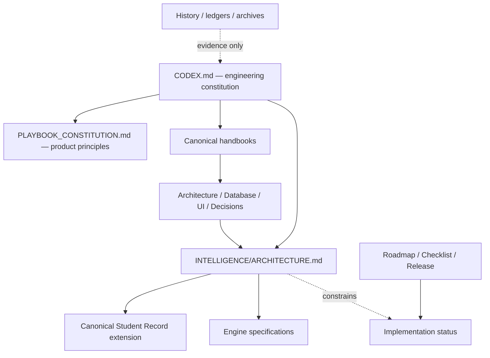

# PLAYBOOK-CONST-001 Constitutional Discovery and Gap Analysis

## Purpose
Record the repository evidence reviewed on July 24, 2026, distinguish canonical state from proposals, and recommend a non-duplicative Intelligence Architecture extension.

## Ownership
Owned by Playbook OS Engineering. This report is analysis, not a replacement constitution.

## Last Updated
July 24, 2026

## Related Documents
- [Documentation map](./README.md)
- [Intelligence architecture](./ARCHITECTURE.md)
- [Engineering Constitution](../../CODEX.md)
- [Canonical documentation policy](../DOCUMENTATION/CANONICAL_DOCS.md)

## Executive summary
Playbook already has a coherent constitutional center: Scholar Record first; opportunity rather than attention; verified over claimed; one Scholar, one lifelong story; AI assists and humans decide; support systems are equipped rather than displaced. The repository also contains working or partial domain surfaces for Compass, Portfolio, opportunity matching, evidence, verification, events, support relationships, and recommendation workflows. The missing layer is not a new vision. It is a governed contract that makes those systems interoperate around explainable next actions.

This extension makes the existing Phase III Intelligence Layer implementation-grade. It defines a shared recommendation envelope, lifecycle, permission and verification requirements, engine boundaries, cross-engine events, and phased adoption. The product constitution remains untouched; `CODEX.md` gains a concise amendment and delegates detail to the canonical architecture specification.

## Discovery method and limits
Discovery examined repository documentation, route/component names, `lib/` domain modules, migrations, tests, and the documentation registry. “Implemented” below means repository evidence exists, not that production readiness has been proven. Historical, generated, deprecated, backup, release, and journal documents are evidence but not normative authority. No runtime claims were inferred from screen names alone.

## Constitutional inventory
| Authority | Location | Purpose and relationship | Dependencies / overlap / conflict risk |
| --- | --- | --- | --- |
| Supreme engineering | `CODEX.md` | Engineering constitution; declares mission, canonical handbook, architecture and completion rules | Governs every specification; overlaps product constitution without displacing it |
| Execution authority | `AGENTS.md` | Repository and agent operating rules | Subordinate to direct instructions and Constitution |
| Product constitutional | `docs/PLAYBOOK_CONSTITUTION.md` | Mission, vision, pillars, AI/human, verification, Portfolio and Phase III principles | Source for this extension; older formatting/metadata differs from handbook but no substantive conflict |
| Canonical handbooks | `docs/ARCHITECTURE.md`, `DATABASE.md`, `UI_DESIGN_SYSTEM.md`, `DECISIONS.md` | Platform, data, experience, and decision standards | Intelligence changes must conform and produce ADRs/migrations when implemented |
| Direction / delivery | `docs/ROADMAP.md`, `MASTER_CHECKLIST.md`, `RELEASE_PROCESS.md`, `auto_sprint.md` | Planned sequence, authoritative work board, gates, execution | Architecture is normative; maturity and scheduling remain here |
| Mission / philosophy | `docs/PLAYBOOK_PHILOSOPHY.md`, `PLAYBOOK_NORTH_STAR.md`, `VISION/*`, `PRODUCT/PRODUCT_PHILOSOPHY.md` | Opportunity, confidence, ownership, support, theory of change, success | Consistent with both constitutions; some empty vision stubs and overlapping narratives need lifecycle review |
| Record / portfolio | `docs/ENGINEERING/PLAYBOOK_RECORD.md`, `SCHOLAR_RECORD_DATA_MODEL.md`, `PLAYBOOK_PORTFOLIO.md`, `PORTFOLIO_ENGINE.md`, ADR-0001/0002 | Record hierarchy, achievement/evidence/verification/outcome, portfolio projections | Names “Playbook Record,” “Scholar Record,” and “Portfolio” can be conflated; this extension explicitly maps them |
| Engines / AI / events | `docs/ENGINE_ARCHITECTURE.md`, `AI_ARCHITECTURE.md`, `EVENT_ENGINE.md`, engine registries and ADRs | Existing engine taxonomy, assistive AI, event flow | Fragmented and unevenly detailed; new spec references rather than copies these rules |
| Journey / feature | `docs/USER_JOURNEYS.md`, onboarding audits, dashboard/design specifications, product registries | Current experiences and route intent | Often thin, historical, or implementation-oriented; does not yet define end-to-end intelligence lifecycle |
| Brand / founder | `docs/DESIGN/*`, `UI_DESIGN_SYSTEM.md`, `FOUNDER/*`, archives | Visual language, history, founder intent | Contextual authority; archives are evidence, never current implementation authority |
| Registry / history | `docs/DOCUMENTATION/*`, `HISTORY/*`, `LEDGER/*`, `releases/*`, `DEPRECATED/*` | Provenance, document status, prior releases | Registries currently classify too many documents as canonical; case-duplicated generated architecture trees are a navigation risk |

## Constitutional analysis
### Product mission and core philosophy
Playbook builds the Operating System for Scholars so each Scholar owns a verified, lifelong record that creates college, career, entrepreneurship, athletics, military, scholarship, financial, and community opportunity. Its educational philosophy is agency through evidence: meaningful action produces learning and living evidence; trusted people verify and contextualize it; the platform turns it into momentum. Confidence and real outcomes—not attention—are the measures of value.

### Existing architectural principles
Scholar Record first; domain engines before page logic; role and relationship awareness by default; server-side trust boundaries; migration-managed Supabase with RLS; event-driven decoupling; evidence provenance; explainable trust; accessible shared UI; human control of consequential AI outputs; and documentation through ADRs.

### Existing Scholar journey
The evidenced journey is: establish identity and role; onboard and invite the Starting Five; record academics, activity, achievement and goals; attach evidence and seek verification; build Portfolio/timeline/readiness; receive guided opportunities and next steps; collaborate on applications and documents; complete learning and milestones; and carry the record forward. The journey is present across several surfaces, but not yet governed as one state machine.

### Existing canonical models
The Playbook Record is the general record family. The Scholar Record is the Scholar-specific source of truth. Achievements connect to evidence, verification, reflection, outcomes, evidence packs, timeline and portfolio projections. Profiles, roles, support relationships, opportunities, applications, events, trust signals, rewards, and generated documents exist at varying levels of definition. “Canonical Student Record” in the mission is therefore adopted as an audience-neutral alias for the existing Scholar Record, not a new parallel record.

## Intelligence capability maturity
Maturity scale: **implemented** = domain logic, UI/data boundary and tests are evidenced; **partial** = some of those exist; **specified** = documentation or mock surface without verified end-to-end path; **absent** = no material evidence found.

| Capability | Maturity | Repository evidence and constitutional conclusion |
| --- | --- | --- |
| Compass | Partial | `lib/compass/`, event handler, route and components establish recommendation/reasoning concepts; production data and lifecycle integration remain unproven |
| Resume Intelligence | Partial | Portfolio resume service and toolkit builder/export exist; verified automatic multi-view lifecycle is not established |
| Scholarship Intelligence | Specified / partial | Opportunity engine and application workspace can support scholarships; dedicated eligibility, probability and packet engine is not evidenced end to end |
| Financial Literacy | Specified / partial | Courses, financial onboarding and scholar-athlete financial logic exist; canonical Four Cs journey, simulations and certification sequence are not established |
| Mentor Intelligence | Partial | Mentorship routes, mentor OS, support relationships and workflows exist; governed matching/relationship-health engine is incomplete |
| Career Journey | Partial | Scholar career module and journey/opportunity surfaces exist; longitudinal pathway, salary and scenario model is incomplete |
| Recommendation Letter Intelligence | Partial | Recommender auth/workflow and recommendation studio exist; immutable delivery, evidence snapshots and institutional integration are incomplete |
| Event Center | Partial | Event route, community event surface, Event Engine and event bus exist; unified intelligence deadline/event contract needs definition |
| Opportunity recommendations | Partial | Opportunity and graph engines, repositories and feed exist; shared eligibility/explanation/outcome contract is missing |
| Career planning | Partial | Career record and UI concepts exist; see Career Journey |
| Student verification | Partial | Evidence/verification models, services and trust engine exist; assurance levels, expiry and dispute workflow need unification |
| Support network | Partial | Starting Five, support-network modules, live access and workflows exist; consent lifecycle and intelligence escalation contract need completion |

## Gap analysis and recommendations
| Gap | Risk | Recommendation (proposed extension) |
| --- | --- | --- |
| No shared recommendation contract | Engines rank incompatible objects and cannot learn from outcomes | Adopt the recommendation envelope and lifecycle in `ARCHITECTURE.md` |
| Record/Portfolio terminology ambiguity | Duplicate stores and unclear ownership | Keep Scholar Record canonical; treat Portfolio/resume/profile as projections |
| Uneven evidence assurance | False confidence and unfair prioritization | Define provenance, verification level, freshness, dispute and expiry on evidence |
| Fragmented permissions | Sensitive context may leak across engines/support roles | Require purpose-bound grants, least privilege, RLS and field-level redaction |
| Missing consent for minors and public sharing | Safety/legal exposure | Add age/jurisdiction-aware guardian, Scholar assent, revocation and sharing policy review before schema work |
| No recommendation governance | Harm, bias and automation risk | Version policies/models, log inputs/outputs, expose explanations, appeal, human escalation and kill switches |
| No canonical deadline/event semantics | Missed or duplicated action | Normalize deadlines, time zones, source authority, recurrence and Event Center links |
| Weak cross-engine outcome learning | Optimization cannot be audited | Record shown/accepted/dismissed/completed/expired/overridden outcomes without optimizing for engagement |
| Missing canonical models | Scholarship applications, mentor relationships, career scenarios, resume versions and letters are loosely related | Add models only by reviewed migrations, preserving record IDs and provenance |
| Missing workflows | Verification disputes, stale recommendation, mentor intervention, packet reuse, external delivery | Implement explicit state machines specified in engine documents |
| Missing integrations | SIS/LMS, transcript, FAFSA, scholarship feeds, calendar, job/credential and letter delivery | Use adapters with source contracts, consent, reconciliation and failure isolation; no integration is canonical until approved |
| Accessibility gaps in intelligence | Rankings may be unusable or coercive | Require plain-language rationale, non-color cues, keyboard/screen-reader support, reduced motion and alternative planning modes |
| Documentation sprawl | Competing “canonical” claims | Maintain this map; resolve duplicated case trees and empty vision stubs through documentation governance, not deletion here |

## Constitutional extension proposal
Adopt the `CODEX.md` section **Playbook Intelligence Architecture** and designate `docs/INTELLIGENCE/ARCHITECTURE.md` as its normative detail. This is a proposed constitutional extension because existing documents authorize Phase III intelligence but do not fully specify its shared contracts. It does not revise product principles, create a new constitution, or declare unbuilt capabilities complete.

### Assumptions requiring owner validation
1. “Canonical Student Record” is synonymous with the existing Scholar Record for Scholars; “Playbook Record” remains the wider record family.
2. The Starting Five remains the primary support construct but can coexist with additional permissioned supporters.
3. Probability scores are decision support, never guarantees or admissions/award decisions.
4. Financial education is educational guidance, not individualized financial, tax, legal, or investment advice.
5. Public profiles, immutable letters, external delivery, minor consent, and institutional data exchange require legal/privacy review before implementation.

## Updated documentation relationships

