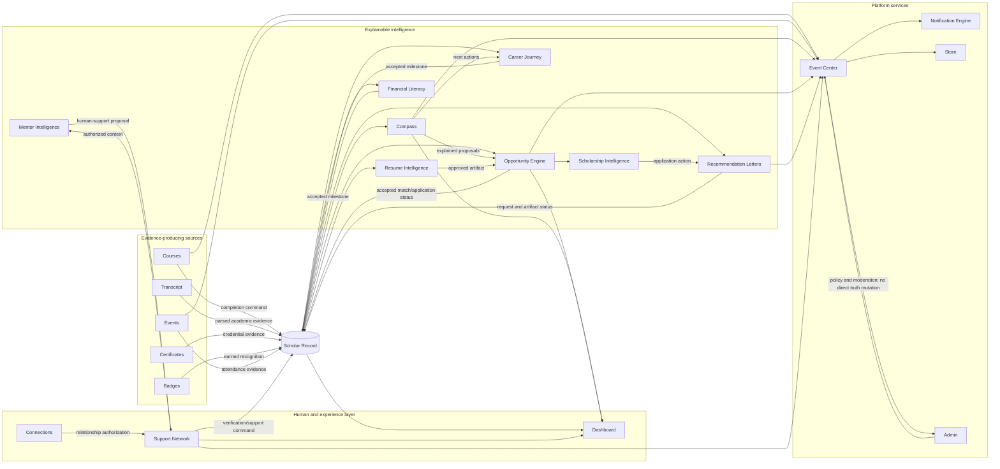

# Playbook Engine Dependency Graph

## Purpose
Define the canonical, acyclic flow of trusted data, decisions, actions, and delivery among Playbook engines so implementation cannot create a competing Scholar Record or duplicate platform services.

## Ownership
Owned by Playbook OS Engineering.

## Last Updated
July 25, 2026

## Related Documents
- [Canonical implementation roadmap](./PLAYBOOK_IMPLEMENTATION_ROADMAP.md)
- [Intelligence architecture](./ARCHITECTURE.md)
- [Canonical Student Record](./CANONICAL_STUDENT_RECORD.md)
- [Playbook Data Map](./PLAYBOOK_DATA_MAP.md)
- [Traceability Matrix](./PLAYBOOK_TRACEABILITY_MATRIX.md)
- [Schema Gap Analysis](./PLAYBOOK_SCHEMA_GAP_ANALYSIS.md)

## Governing Direction

The Scholar Record is the sole canonical student record. Source systems submit validated commands to it; intelligence engines consume authorized, versioned projections; experience engines present proposals and capture human choices; platform services deliver events, notifications, administration, and rewards. A delivery failure never changes Record truth. An intelligence output is never silently promoted to fact.

## Dependency Contract

| Node | Consumes | Produces | Depends on | Updates | Verifies | Authorizes | Explains |
|---|---|---|---|---|---|---|---|
| Scholar Record | Validated profile, evidence, learning, relationship, outcome, and workflow commands | Authorized projections, evidence packs, timeline state | Auth, roles, RLS, evidence and verification | Its existing canonical tables only | Claim status through existing verification workflow | Minimum-necessary projections and shares | Provenance and verification state |
| Compass | Authorized Record projection, academic and opportunity signals | Goals, recommendations, next-step proposals, reasons | Scholar Record, repositories, explainability contract | Nothing directly; accepted actions return through commands | Nothing | Scholar choice over accept, edit, defer, dismiss | Factors and human-readable reasons |
| Resume Intelligence | Authorized Record/evidence projection and target opportunity | Scholar-edited draft, export/share snapshot | Scholar Record, portfolio sharing, application workspace | Approved artifact/reference only | Never verifies its own prose | Scholar controls inclusion, wording, audience and expiry | Why evidence was suggested |
| Opportunity Engine | Record projection, Compass signals, opportunity ontology | Ranked matches, readiness gaps, reasons | Scholar Record, repository adapters | Accepted match/application status | Source freshness and hard criteria, not Scholar claims | Scholar chooses search, save, dismiss and apply | Eligibility, fit, missing data and alternatives |
| Scholarship Intelligence | Opportunity candidates, scholarship rules, Record projection | Scholarship-specific eligibility/readiness and actions | Opportunity Engine, applications, notifications | Existing match/workspace state | Listing source and rule freshness | Scholar retains independent search/application choice | Hard rules versus inferred fit |
| Financial Literacy | Course progress, Record milestones, consented context | Educational next-step proposals and competency milestones | Courses, permissions, support network | Accepted learning evidence/milestones | Course completion, never financial fitness | Scholar controls sensitive sharing | Educational rationale and non-advice boundary |
| Career Journey | Goals, evidence, courses, opportunities and mentor context | Alternative pathways and reversible next steps | Record, Compass, Resume, Opportunity, Mentors | Accepted outcome/timeline milestones | Evidence-backed competency only | Scholar revises goals and selects paths | Alternatives, evidence gaps and dated sources |
| Mentor Intelligence | Scholar-stated goal, authorized directory and relationship context | Explainable candidates or missing-support suggestions | Connections, Support Network, trust/moderation | Existing invitations/shared actions only | Eligibility/safety checks, not personal claims | Mutual consent and least-privilege views | Fit, constraints, capacity and alternatives |
| Recommendation Letters | Consented evidence pack, request, opportunity and deadline | Request lifecycle and recommender-owned artifact status | Record, workspace, recommender auth, mail, events | Existing request and application status | Identity and evidence references; recommender owns claims | Scholar controls evidence share; recommender controls letter | Evidence basis and lifecycle status |
| Courses | Curriculum and learner progress | Completion events and evidence candidates | Auth, content governance | Record only after validated completion | Assessment/completion under course rules | Enrollment and content access | Requirements and completion state |
| Transcript | Scholar upload and parser result | Reviewable academic evidence | Upload/parser security and Record command | Accepted courses/academic signals | Source/parser confidence; human confirms extraction | Scholar controls upload and correction | Parsed value, source and uncertainty |
| Certificates | Course/issuer completion evidence | Credential evidence and portfolio view | Courses, issuer/provenance rules | Record achievement/evidence | Issuer and revocation status | Scholar controls sharing | Issuer, criteria and status |
| Badges | Governed achievement/reward events | Recognition and portfolio view | Event/reward rules | Record achievement only when rules are met | Rule satisfaction, not identity beyond source | Scholar controls display | Earning criteria and source event |
| Events / Event Center | Community event records, RSVPs and domain events | Participation evidence candidates and normalized lifecycle events | Event bus, auth, RLS | Existing event/RSVP tables; Record via validated command | Attendance when an authorized organizer attests | Organizer/attendee scopes | Status, source and event reason |
| Notification Engine | Committed Playbook events and preferences | In-app/digest/escalation delivery | Event Center, recipient resolver, preferences | Notification/delivery state only | Nothing | Recipient preferences and relationship permissions | Why a notice was sent |
| Connections | Invitations, blocks, mutes and user choice | Relationship intent/state | Auth, roles, trust controls | Existing support relationship graph | Identity/relationship state where supported | Mutual connection consent | Relationship state |
| Support Network | Relationships, messages, shared actions and permissions | Coordinated human support and verification actions | Connections, permissions, trust, notifications | Existing relationship/action/message tables and approved Record commands | Authorized supporter evidence under role rules | Field/action-level access | Who can help, why, and within what scope |
| Dashboard | Permission-filtered Record and engine read models | Views and user-initiated commands | Record and relevant engines | Nothing directly | Nothing | Role-aware presentation | Freshness, status and recommendation reasons |
| Store | Product catalog, balance, reward events | Redemption state | Economy integrity, events, auth/RLS | Store/redemption/ledger tables only | Ledger integrity | Scholar confirms redemption | Price, balance and redemption status |
| Admin | Moderation reports, operational events and policy-scoped data | Audited moderation/configuration actions | Roles, permissions, RLS, audit/event services | Moderation state through governed handlers | Policy compliance, not Scholar achievements | Explicit admin policy only | Action reason and audit trail |

## Acyclic Layering Rules

1. **Sources → Record:** sources may propose or validate Record changes; they do not own a shadow student profile.
2. **Record → Intelligence:** engines read permission-filtered projections. Intelligence-to-Record edges are accepted commands, never implicit writes.
3. **Intelligence → Human experience:** recommendations are proposals; the Scholar or authorized human remains the decision-maker.
4. **Domain → Event Center → Notifications/Store/Admin:** event delivery and operational consumers cannot become prerequisites for canonical writes.
5. **Relationships → authorization:** Connections establishes mutual state; Support Network applies permissions; Mentor Intelligence may suggest but cannot create a relationship.
6. **Specialization extends a parent:** Scholarship Intelligence extends Opportunity Engine; it does not build a second catalog, matcher, application system, or notification path.
7. **Read models do not become truth:** Dashboard and exports consume state and dispatch governed commands only.

## Forbidden Cycles and Duplicate Boundaries

- Compass, Dashboard, Resume, and Opportunity outputs must not become independent student records.
- Notification delivery must not confirm a domain transaction; it follows a committed event.
- Coins, badges, and store redemptions must not self-verify the activity that awarded them.
- Mentor recommendations must not auto-create Connections, and Connections must not infer mentor suitability.
- Scholarship and career specializations must not fork Opportunity or journey workflows.
- Admin may moderate or authorize through explicit policy, but must not bypass canonical validation or RLS.

## Validation

Each implementation gate must prove that its edges follow this graph through repository discovery, contract tests, RLS/permission tests, idempotency tests, and a duplicate-table/API/workflow check. Any required new edge must be reviewed against the Constitution and recorded here before implementation.
